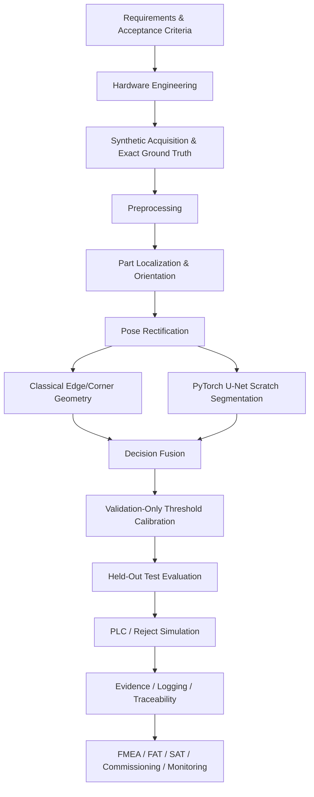

# End-to-End Machine-Vision System PoC

**Repository:** `mghazel--end-to-end-machine-vision-system-poc`  
**Author:** mghazel  
**Submitted to:** Ascension Automation Solutions Ltd.  
**Version:** 2026-09-26

> **Qualification boundary:** This repository is a standalone, executable industrial machine-vision proof of concept. It demonstrates quantitative hardware engineering, reproducible synthetic acquisition, conventional CV, PyTorch segmentation, decision calibration, held-out synthetic evaluation, PLC/reject simulation, traceability, and production-readiness planning. Synthetic-domain performance is **not** factory acceptance; representative real data and physical commissioning remain mandatory.

## 1. Application

| Item | Practical definition |
|---|---|
| Product | Matte-gray rectangular part, nominally 200 × 120 mm |
| Transport | Conveyor at 500 mm/s; one part inspected at a time |
| Pose | Top-down imaging; up to ±20° rotation and small translation |
| Legitimate variation | Surface texture, gray-level variation, illumination gradient, text/logos, blur/noise |
| Scratch/cut defect | Dark line-like defect, target ≥0.5 mm wide and ≥5 mm long |
| Edge damage | Deviation/chip from nominal straight edge, target ≥2 mm |
| Corner damage | Damage to nominal 90° corner, target ≥2 mm |
| Mixed defect | Appearance and geometric defects on the same part |
| Nominal FOV | 240 × 200 mm |
| Imaging target | ≥5 pixels across minimum scratch; ≤0.2-pixel motion blur |
| Software target | ≤200 ms p95 inspection latency (PoC target) |
| Output | PASS/REJECT, reason, metrics, PLC/reject event and traceable evidence |

## 2. Implemented Machine-Vision System Architecture



The architecture deliberately uses **deterministic CV where strong geometry exists** and **deep learning where defect appearance varies**. This reduces unnecessary model dependence and makes failure analysis easier.

## 3. System Modules / Components

### 3.1 Requirements

| Requirement group | Implemented interpretation | Verification |
|---|---|---|
| Geometry | 200 × 120 mm part, ±20° pose, 240 × 200 mm FOV | Analytical envelope calculation |
| Surface defect | ≥0.5 mm scratch width, ≥5 mm length | Pixel-sampling calculation + synthetic labels |
| Geometry defect | ≥2 mm edge/corner damage | Deterministic geometry inspection |
| Motion | 500 mm/s conveyor | Exposure/blur calculation |
| Throughput | Software p95 target ≤200 ms | Held-out latency measurement |
| Quality | High recall with controlled false accepts/rejects | Confusion matrix, recall, FAR, FRR, F1 |
| Traceability | Per-part decision and integration evidence | CSV/JSON/logs/plots/PLC events |

### 3.2 Hardware Engineering

| Component | Candidate / design basis | Quantitative validation | Production verification |
|---|---|---|---|
| Camera | Basler a2A2440-98g5mBAS-class, 2448×2048 mono global shutter | 240/2448 ≈ 0.0980 mm/px; 200/2048 ≈ 0.0977 mm/px | Verify exact SKU, frame rate, exposure, trigger, interface and availability |
| Sampling | 0.5 mm minimum scratch | ≈5.1 pixels across minimum scratch | Confirm MTF/SNR/contrast and orientation sensitivity with physical target |
| Lens | ~12 mm C-mount, 2/3-inch class | Sensor ≈8.45×7.07 mm; thin-lens estimate gives ~350 mm WD | Verify distortion, MTF, focus, aperture/DOF and mechanical fit |
| Lighting | Diffuse/controlled bright-field concept | Supports dark scratch contrast on matte gray surface | Bench-select geometry, wavelength, diffuser/polarization and intensity |
| Exposure | 30 µs design point | 500 mm/s × 30 µs = 0.015 mm motion ≈0.154 px | Verify photon budget and strobe/continuous-light thermal margin |
| Trigger | Photoelectric/PLC trigger; encoder recommended | One image per part; deterministic tracking | Verify jitter, debounce, missed/double triggers and encoder synchronization |
| IPC/compute | Industrial PC with CPU + GPU/edge option | Software latency measured by pipeline | Size from final model, camera SDK, I/O, storage and plant IT requirements |
| PLC/reject | PLC handshake + reject station | 750 mm / 500 mm/s = 1.5 s nominal travel delay | Prefer encoder/sequence tracking and reject confirmation sensor |

### 3.3 Synthetic Acquisition

```text
Nominal part geometry
      + material/gray texture
      + illumination gradient
      + text/logo nuisance variation
      + random pose/translation
      + sensor blur/noise
      + scratch / edge / corner / mixed defect
                ↓
 image + exact mask + bbox + class + split + metadata
```

The generator is deterministic from a base seed, enabling exact regeneration and controlled QA. The default 400-image dataset is a development-scale experiment; larger and more diverse data is required for serious model optimization.

### 3.4 Preprocessing

| Operation | Purpose | Design intent |
|---|---|---|
| Grayscale handling | Stable single-channel pipeline | Matches monochrome industrial-camera concept |
| Denoising / normalization | Reduce nuisance variation | Preserve defect edges while stabilizing localization |
| Threshold/contour preparation | Separate part from background | Deterministic part localization |

### 3.5 Localization / Orientation

```text
Preprocessed image → foreground segmentation → dominant contour
→ minimum-area rotated rectangle → centroid + angle + dimensions
→ plausibility information for downstream inspection
```

The localization result is a structured contract used by rectification, geometry inspection and visual overlays.

### 3.6 Rectification

```text
Detected rotated rectangle
        ↓
ordered corner coordinates
        ↓
perspective transform
        ↓
canonical top-down part ROI
```

Canonical rectification reduces pose variance before learned scratch segmentation and makes geometric interpretation more repeatable.

### 3.7 Classical Geometry + PyTorch Scratch Segmentation

| Branch | Method | Best suited for | Output |
|---|---|---|---|
| Classical CV | Rotated-rectangle/geometry consistency | Straight edges, 90° corners, gross chips | Geometry-damage flag + measurements |
| PyTorch | Compact U-Net binary segmentation | Variable dark scratches/cuts | Probability map, binary mask, positive-area fraction |

The U-Net training path uses normal + scratch samples because the current mixed-defect synthetic mask is combined rather than per-defect. This avoids teaching the scratch model that geometric-chip pixels are scratches.

### 3.8 Decision Fusion

```text
geometry_damage == True
            OR
scratch_fraction >= calibrated_threshold
            ↓
          REJECT
otherwise → PASS
```

The decision record retains the contributing measurements so a reject is explainable and auditable.

### 3.9 Validation Calibration

The scratch-area decision threshold is swept on the **validation split only**. Balanced accuracy is the primary selection criterion, followed by F1 and then threshold as tie-breakers. The selected threshold is frozen before test evaluation, preventing test-set tuning.

### 3.10 Held-Out Evaluation

| Evidence | Purpose |
|---|---|
| TP/TN/FP/FN | Direct part-level outcome counts |
| Accuracy / precision / recall / specificity / F1 | Overall decision performance |
| False-accept rate | Defective parts incorrectly passed |
| False-reject rate | Good parts incorrectly rejected |
| Per-class results | Diagnose scratch/edge/corner/mixed behavior |
| Latency mean/median/p95/max | Throughput feasibility |
| Confusion matrix | Visual decision summary |
| Failure gallery | Engineering root-cause review |

These metrics are synthetic-domain software evidence and must not be presented as factory-qualified accuracy.

### 3.11 PLC / Reject Simulation

The simulator creates an ordered event containing part ID, sequence number, PASS/REJECT decision, reason, inspection latency and reject delay. At 500 mm/s with a 750 mm camera-to-reject distance, nominal transport delay is 1.5 s. A production implementation should use PLC/encoder part tracking, handshake/watchdog logic and reject confirmation.

### 3.12 Evidence / Logging

| Evidence | Location / purpose |
|---|---|
| Engineering JSON/CSV/plots | Imaging feasibility and design review |
| Dataset images/masks/JSONL/manifest | Ground-truth traceability |
| Classical CV summary | Localization/geometry evidence |
| Training summary/checkpoint | Model reproducibility |
| Hybrid trace images | Module-by-module visual inspection |
| Calibration JSON/curve | Threshold-selection traceability |
| Evaluation CSV/JSON/plots | Held-out quantitative evidence |
| PLC events | Integration contract evidence |
| FMEA/FAT/SAT plan | Production-readiness governance |
| Runtime log | Operational troubleshooting |

## 4. Folder Structure

```text
mghazel--end-to-end-machine-vision-system-poc/
├── .github/workflows/ci.yml
├── config/system.yaml
├── docs/
│   ├── architecture.md
│   ├── hardware_bom.csv
│   ├── synthetic_acquisition.md
│   ├── engineering_assumptions_and_risks.md
│   └── production_readiness.md
├── scripts/main.py
├── src/vision_poc/
│   ├── classical_cv.py
│   ├── configuration.py
│   ├── dataset.py
│   ├── engineering.py
│   ├── evaluation.py
│   ├── hybrid.py
│   ├── logging_utils.py
│   ├── metrics.py
│   ├── model.py
│   ├── plc.py
│   ├── production_readiness.py
│   ├── reporting.py
│   ├── synthetic.py
│   ├── torch_data.py
│   └── training.py
├── tests/
├── pyproject.toml
├── requirements.txt
└── README.md
```

Runtime execution creates `results/inspection_run/` and `logs/machine_vision_poc.log`; generated runtime evidence is intentionally separated from source code.

## 5. Installation

| Action | Windows PowerShell |
|---|---|
| Create environment | `py -3.12 -m venv .venv` |
| Activate | `.\.venv\Scripts\Activate.ps1` |
| Upgrade pip | `python -m pip install --upgrade pip` |
| Install editable + dev tools | `python -m pip install -e ".[dev]"` |
| Dependency check | `python -m pip check` |
| Ruff | `python -m ruff check src scripts tests` |
| Tests | `python -m pytest -q` |
| Fast non-training run | `python scripts/main.py --skip-training` |
| Full experiment | `python scripts/main.py` |

In PyCharm, select the project `.venv` interpreter, use `scripts/main.py` as the script path, and set the repository root as the working directory.

## 6. Requirements

`requirements.txt` contains the standalone dependency set. Core runtime packages are PyYAML, NumPy, OpenCV-headless, Matplotlib and PyTorch; pytest and Ruff provide automated validation. Python 3.12 is recommended for the demonstrated environment.

## 7. Engineering Interpretation

| Observation | Interpretation / action |
|---|---|
| ~5 px across minimum scratch | Meets nominal sampling target, but physical detectability still depends on optics/MTF/SNR/contrast |
| ~0.154 px estimated motion blur | Meets ≤0.2 px design target at assumed speed/exposure |
| Hybrid architecture | Uses explicit geometry where possible and DL only where appearance variability justifies it |
| Validation-only calibration | Protects test-set independence and reduces optimistic reporting |
| PLC simulation | Demonstrates software contract/timing, not physical I/O qualification |
| Synthetic evaluation | Demonstrates feasibility and exposes failure modes; does not establish production accuracy |

## 8. Limitations and Domain Gap

| Limitation | Why it matters | Mitigation |
|---|---|---|
| Synthetic material/BRDF | Real texture/specularity may differ | Collect representative real parts across lots/conditions |
| Simplified optics | MTF, distortion, vignetting and focus variation are incomplete | Bench characterize camera/lens/light system |
| Combined mixed-defect mask | Prevents clean per-defect multi-task supervision | Generate separate scratch/edge/corner masks |
| Development-scale dataset/model | Metrics may be unstable | Increase data diversity, train longer, repeat seeds, compare models |
| No physical PLC/camera | Timing/I/O faults are not physically exercised | Integrate SDK, PLC protocol, encoder, watchdog and reject confirmation |
| No real acceptance set | Synthetic metrics cannot support factory sign-off | Freeze independent real SAT/acceptance dataset |

## 9. Production Readiness

The executable generates `09_production_readiness/` containing a structured FMEA and FAT/SAT/commissioning/monitoring/maintenance plan. Key principles are fail-safe handling of uncertain states, version/config/model traceability, independent real-data acceptance, monitored drift and controlled retraining/rollback.

See `docs/production_readiness.md` for the complete plan.

## 10. Future Work

| Priority | Improvement | Expected value |
|---|---|---|
| 1 | Acquire representative real factory data and quantify domain gap | Required for any production claim |
| 2 | Separate synthetic masks by defect type | Enables multi-task learning and cleaner supervision |
| 3 | Expand dataset and nuisance distributions; train longer/multiple seeds | More stable model estimates |
| 4 | Compare U-Net variants/anomaly methods and tune operating point | Better recall/FAR trade-off |
| 5 | Physical camera/lens/light bench validation | Confirms sampling, MTF, exposure, DOF and contrast |
| 6 | PLC/encoder/reject integration with watchdog and confirmation | Production control-system readiness |
| 7 | Golden-part monitoring, drift dashboards and MLOps release controls | Lifecycle maintainability |
| 8 | FAT/SAT execution with customer-approved acceptance criteria | Final production qualification |

## 11. Final Engineering Statement

The project demonstrates a coherent end-to-end industrial machine-vision design methodology: translate defect requirements into imaging constraints; select and mathematically validate candidate hardware; create traceable data; combine deterministic CV and PyTorch segmentation; calibrate without test leakage; evaluate decisions and latency; simulate control-system handoff; and explicitly plan the domain-gap, risk, commissioning and lifecycle controls required for production. The remaining gap is intentional and clearly bounded: **factory qualification requires physical hardware and representative independently labeled real production data.**

## Presentation Evidence and Comprehensive Evaluation

The default synthetic dataset contains **600 images** (70% train, 15% validation, 15% held-out test). The larger CPU-oriented dataset improves statistical support for the PoC while remaining practical for a laptop without a GPU. It does not replace representative real-factory validation.

Running the full pipeline creates `results/inspection_run/10_presentation_evidence/`:

```text
10_presentation_evidence/
├── 01_processing_sequence/
│   ├── 01_common_test_image.png
│   ├── 02_preprocessed.png
│   ├── 03_localization.png
│   ├── 04_orientation.png
│   ├── 05_rectified.png
│   └── processing_sequence.json
├── 02_classical_geometry/
│   ├── overlays_all_test_images/
│   ├── ccv_test_results.csv
│   ├── ccv_evaluation_summary.json
│   └── ccv_part_level_metrics.png
├── 03_unet/
│   ├── dataset_examples/
│   ├── unet_architecture.png
│   ├── learning_curve_loss.png
│   ├── learning_curve_dice.png
│   ├── overlays_all_unet_test_images/
│   ├── unet_test_metrics_per_image.csv
│   ├── unet_evaluation_summary.json
│   └── unet_segmentation_metrics.png
└── 04_decision_fusion/
    ├── overlays_all_test_images/
    ├── fusion_test_results.csv
    ├── fusion_evaluation_summary.json
    └── fusion_part_level_metrics.png
```

### Evaluation interpretation

| Pipeline | Evaluation population | Primary metrics |
|---|---|---|
| CCV geometry | All held-out test images | Accuracy, Precision, Recall, Specificity, F1, FAR, FRR |
| CCV discrepancy mask | Normal + edge-damage + corner-damage test images | Pixel Precision, Recall, Dice, IoU |
| U-Net scratch segmentation | All held-out normal + scratch images | Pixel Precision, Recall, Dice/F1, IoU |
| Hybrid CCV + U-Net | All held-out test images | Accuracy, Precision, Recall, Specificity, F1, FAR, FRR |

The CCV geometry branch is fundamentally **part-level defect detection** based on rectangularity, solidity, and polygon corner count. The additional discrepancy mask approximately localizes missing material for visualization and pixel-level analysis; it should not be confused with a learned semantic-segmentation model. See `docs/additional_refinements.md` for the complete scope and label-integrity rationale.
