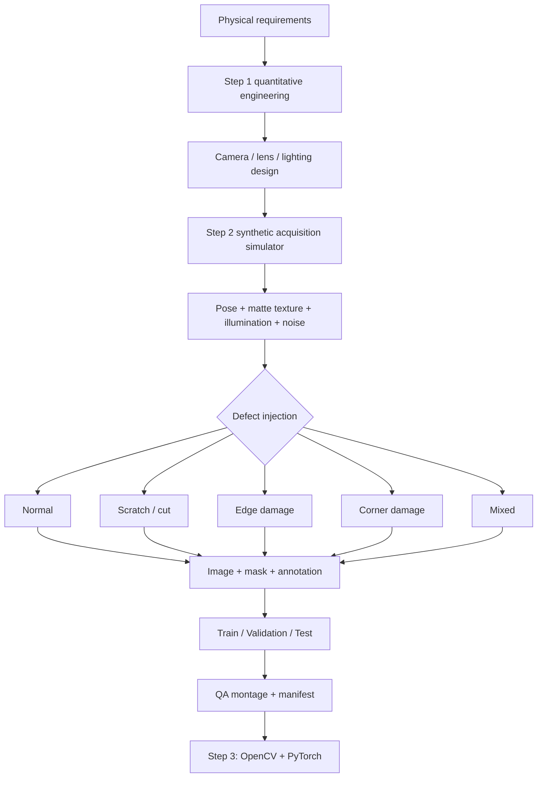

# Architecture — cumulative through Step 2

Step 2 simulates data acquisition only. It does not claim optical photorealism,
factory validation, trained-model accuracy, PLC integration or deployment.
