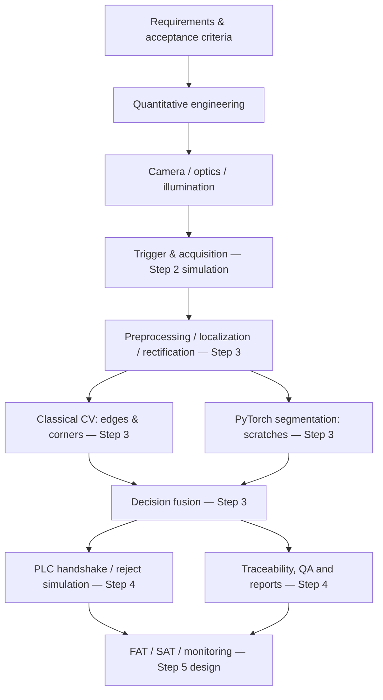

# Step 1 — High-level architecture

**Step 1 implemented:** YAML config, validated mathematical design, checks, reports, visualizations, tests and CI. The acquisition/CV/AI/PLC modules shown above are planned, **not implemented** in Step 1.
