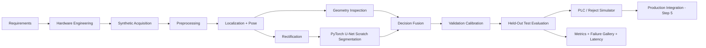

# Cumulative System Architecture — Through Step #4

```mermaid
flowchart LR
  A[Requirements] --> B[Hardware Engineering]
  B --> C[Synthetic Acquisition]
  C --> D[Preprocessing]
  D --> E[Localization + Pose]
  E --> F[Rectification]
  E --> G[Geometry Inspection]
  F --> H[PyTorch U-Net Scratch Segmentation]
  G --> I[Decision Fusion]
  H --> I
  I --> J[Validation Calibration]
  J --> K[Held-Out Test Evaluation]
  K --> L[PLC / Reject Simulator]
  K --> M[Metrics + Failure Gallery + Latency]
  L --> N[Production Integration - Step 5]
```

Step #4 implements software integration and a simulated PLC/reject contract. Physical camera/PLC/actuator integration remains outside the current synthetic PoC.
